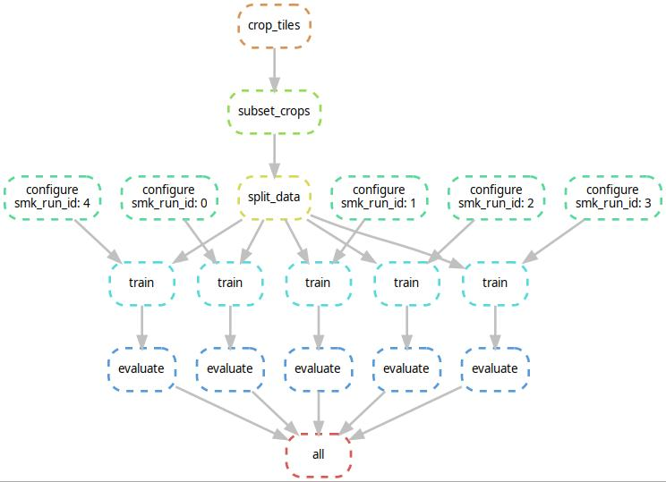

# Cell and Object Classification in CSF

Accompanies our paper:

Leonille Schweizer, Philipp Seegerer et al. "Analysing Cerebrospinal Fluid with Explainable Deep Learning: from Diagnostics to Insights", accepted for publication in *Neuropathology and Applied Neurobiology*. 


## Data

The data are available at [Zenodo](https://zenodo.org/record/6543147).

## How To

The pipeline is built on [Sacred](https://sacred.readthedocs.io/en/stable/), [Snakemake](https://snakemake.readthedocs.io/en/stable/) and [PyTorch](https://pytorch.org/).

First, create a `local_config.py` to set up Sacred:
```
log_dir_root = "/path/to/runs"

def setup_logger(ex):
    # Configuration of Sacred experiment logger
    
   
def add_observers(ex):
    # You need at least the FS observer because it creates the output dir where eg. model files and predictions are saved.
    ex.observers.append(
        sacred.observers.FileStorageObserver(log_dir_root)
    )

    # Add Mongo/Slack or other Sacred observers to the experiment
    # E.g.
    ex.observers.append(
        sacred.observers.MongoObserver()
    )
```

### Snakemake Workflow

1. Create an experiment configuration in YAML format, e.g. `yourconfig.yml` (
   like `dummy_experiment_config.yml`), that contains the:
   * `experiment_name`: name of the experiment in format `<name>_v<version:02d>`
   * `classes`: list of classes that are included (long name, e.g. "aktivierter
     Lymphozyt")
   * `num_classes`: number of class groups during training, i.e. output neurons
   * `common_config`: dictionary of config updates common for all runs in this
     experiment.
   * `config_updates`: dictionary of config updates for the individual runs,
     mapping `"<run_id>" -> <config_update>`.
2. Call the snakemake workflow
   with `snakemake all --cores all --configfile yourconfig.yml`.
   This will automatically detect which stages of the workflow have to be
   executed. Add your custom cluster configuration according to the snakemake
   docs. E.g., if `--default-resources gpus=0 --cluster "qsub -l cuda={resources.gpus} -binding linear:4 -cwd -V -q all.q"`
   is provided, distributes it to different qsub jobs (in parallel, if possible)
   . The stages are connected like (example for two experiment runs):



This will train the model and create a classification report
in `/path/to/runs/<sacred_run_id>/`
